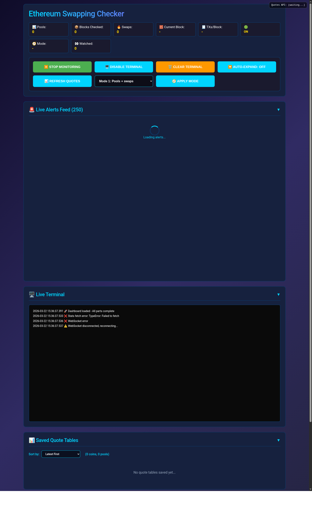

# ETH Chain Swaps Monitor



Real-time **Ethereum swap monitor** with a live browser dashboard. Ingest chain events over WebSocket subscriptions or HTTP block polling, decode Uniswap-style and alternate DEX pool logs, enrich swaps with USD notionals and trade-size ladders, and push alerts to the UI over REST and WebSocket.

Private source: [logicencoder/eth-chain-swaps-monitor](https://github.com/logicencoder/eth-chain-swaps-monitor). RPC keys and wallet lists stay on your infrastructure — not in this public overview.

## The problem it solves

On-chain markets emit thousands of logs per minute. Manual Etherscan refresh does not scale when you track many liquidity pools, follow a **wallet watchlist**, or need consistent **USD framing** and slippage at realistic trade sizes ($100–$1000) at decision time.

This monitor filters, decodes, enriches, and broadcasts swap-relevant activity from your pool configuration and address list — cutting time from “something moved” to “who, how much, which pool, what slippage band.”

## Monitoring modes

| Mode | Transport | Behavior |
|------|-----------|----------|
| **1** — pool swaps | WebSocket `logs` | Subscriptions on configured pool addresses filtered to known swap topic signatures; pending txs and new heads |
| **2** — wallet receipts | HTTP block poll | For each address in your watchlist file: fetch receipt, detect swap logs; full handling for known pools, proof events for unknown pools |
| **3** — all pool logs | WebSocket | Same pools as mode 1 without topic filter — every log from listed contracts |
| **4** | HTTP poll | Wallet-centric receipt path (same family as mode 2) |

Switch mode at runtime via `POST /api/mode`. Modes 2/4 reload the watchlist file without restart. Mode 2 supports optional block backfill and structured debug proof logging.

## Pool and wallet coverage

- Configured liquidity pools from `pool_discovery_database.json` — Uniswap V2/V3 and additional DEX signatures (Curve, DODO, Maverick, and related topic0 lists).
- Wallet watchlist (`add1.txt`) for whale and market-maker tracking.
- Universal pool metadata fetch — one code path across V2/V3 and alternate AMM layouts without hand-maintained ABIs per pool.
- Subscription batching (500 addresses per subscription) to stay under RPC `eth_subscribe` limits.

## Enrichment and persistence

Each confirmed swap can include buy/sell direction, USD size (ETH price from Binance), gas paid, LP fee estimate, liquidity snapshot, and **quote tables** at standard notionals for triage.

- SQLite (`whale_monitor.db`) for durable history and address search.
- Rolling JSON artifacts for stats, alerts, and quote tables.
- Recent alerts ring buffer for a fast dashboard feed without hammering SQLite.
- Address ranking in `swap_stats.json` for repeat buyer/seller behavior.

## Dashboard and API

Single Python service (`eth_chain_swaps_monitor.py`) with **FastAPI** on port **8059** (configurable). Static dashboards: **`candy.html`** (preferred) and legacy **`dashboard.html`**.

| Endpoint | Role |
|----------|------|
| `GET /api/stats` | Aggregated swap statistics |
| `GET /api/alerts` | Recent alert ring buffer |
| `GET /api/search/{address}` | History for an address |
| `GET /api/quote_tables` | Trade-size ladder quotes |
| `GET/POST /api/mode` | Read or change monitoring mode |
| `POST /api/toggle_monitoring` | Pause/resume ingestion |
| `WebSocket /ws` | Live push to the browser |

RPC providers: local Geth (LAN HTTP/WS), dRPC, Infura, Alchemy, QuickNode — selectable via CLI flags or environment variables.

## Quick start

```bash
python3 eth_chain_swaps_monitor.py --local
# Dashboard: http://localhost:8059/candy
```

Common flags: `--geth-custom`, `--drpc`, `--infura`, `--alchemy`, `--monitor-mode`, `--coins-file`, `--port`, `--ui-only`, `--interactive`.

See the private repo README for the full flag list and [REPOS.md](REPOS.md) for repository links.

---

**Made by [Logic Encoder](https://logicencoder.com)** · [GitHub](https://github.com/logicencoder) · [Contact](https://logicencoder.com/contact/)
