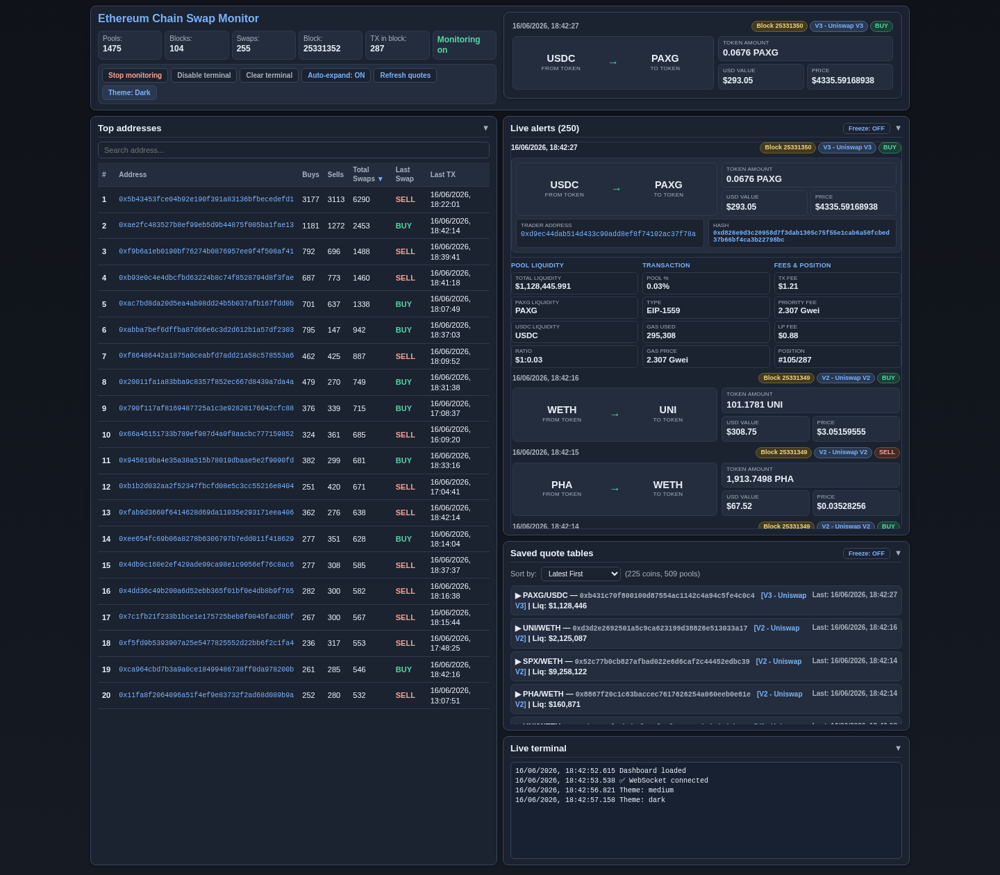
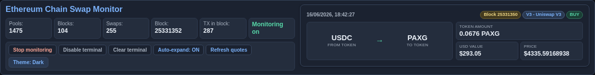
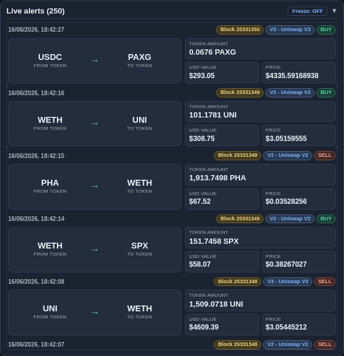
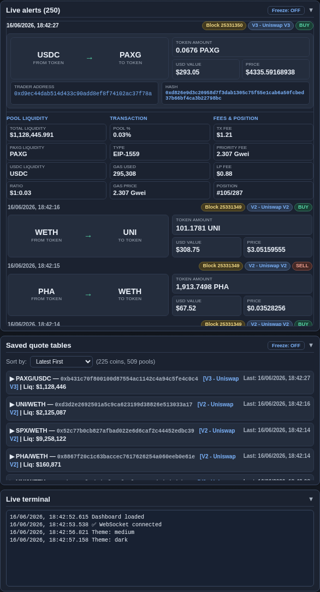

# Ethereum Chain Swap Monitor



Real-time **Ethereum swap monitor** with a compact operator dashboard. The service ingests chain events over WebSocket subscriptions or HTTP block polling, decodes pool swap activity across multiple AMM signatures, enriches events with USD context and quote ladders, and pushes updates to the browser in real time.

Private source: [logicencoder/eth-chain-swaps-monitor](https://github.com/logicencoder/eth-chain-swaps-monitor). RPC keys and wallet lists stay on your infrastructure — not in this public overview.

## Tech stack

| Layer | Technologies |
|-------|--------------|
| Core service | Python + FastAPI |
| Chain ingestion | Web3.py — WebSocket `logs` and HTTP block polling |
| Persistence | SQLite (`whale_monitor.db`) + rolling JSON/JSONL artifacts |
| UI | Single-page `dashboard.html` (CSS/JS inline) — primary operator UI |
| Streaming | REST + WebSocket (`/ws`) on port **8059** (configurable) |

## Dashboard overview

The default UI is **Ethereum Chain Swap Monitor** (`dashboard.html`). It is optimized for long monitoring sessions: dense typography, two-column layout, accordion swap cards, and three visual themes (**Light**, **Medium**, **Dark**). **Dark** is the recommended theme for low-glare night work — slate panels on a charcoal background with high-contrast buy/sell chips.

Operator preferences (theme, auto-expand, freeze toggles, scroll position, expanded swap, panel collapse, quote sort) persist in browser `localStorage` under `ecs-dashboard-prefs`, so a refresh restores layout state without touching the backend.

### Header — live stats and controls



The top band combines **session telemetry**, **transport controls**, and a **live swap preview** of the currently focused alert.

| Stat | Meaning |
|------|---------|
| **Pools** | Configured liquidity pools loaded from discovery metadata |
| **Blocks** | Blocks scanned in the current monitor session |
| **Swaps** | Swap events detected in the current session |
| **Block** | Latest chain head seen by the poller/subscriber |
| **TX in block** | Transaction count in that head block |
| **Monitoring on** | Ingestion active (green) or paused |

Toolbar actions:

- **Stop monitoring** — pauses chain ingestion via `POST /api/toggle_monitoring`; WebSocket stays connected.
- **Disable terminal** — suppresses mirrored log lines in the on-page terminal.
- **Clear terminal** — wipes the visible log buffer (does not delete server history).
- **Auto-expand: ON/OFF** — when ON, each new swap opens as the expanded accordion card at the top of the feed.
- **Refresh quotes** — forces a reload of saved quote tables from `/api/quote_tables`.
- **Theme: Light / Medium / Dark** — cycles visual theme; choice is saved locally.

The right-hand **swap preview** mirrors the expanded or selected alert as a compact mini-card (route, chips, amounts) so context stays visible while scrolling the feed.

### Top addresses — repeat trader ranking


The left column is a full-height **Top addresses** panel backed by `swap_stats.json` on the server. Rows rank wallets by activity with sortable columns:

| Column | Use |
|--------|-----|
| **Buys / Sells** | Directional counts per address |
| **Total Swaps** | Combined activity — default sort |
| **Last Swap** | Most recent BUY or SELL tag (color-coded) |
| **Last TX** | Timestamp of last seen swap (European `DD/MM/YYYY` format) |

The search box filters addresses (minimum two characters). Address cells link to **Etherscan** in a new tab. The panel collapses to save vertical space; collapse state is remembered.

### Live alerts — accordion swap feed



The **Live alerts** feed is a scrollable stack of swap cards fed by `/api/alerts` and live `new_alert` WebSocket events. Only one card is fully expanded at a time (accordion). Collapsed rows show a compact route summary; expanded rows add:

- **Chips** — block number, protocol (V2/V3/DEX name), BUY/SELL action
- **Route** — from token → to token with formatted amounts
- **Trader address** and **transaction hash** side by side — both open Etherscan; clicks do not collapse the card
- **Detail matrix** — three columns of pool liquidity, transaction, and fee/position metadata

**Freeze** on the alerts header pauses feed re-rendering while WebSocket ingestion continues — useful when reading a card during a burst of swaps. Unfreezing catches up via the next render pass.

### Quote tables and terminal



The right column below alerts holds **Saved quote tables** and the **Live terminal**.

**Quote tables** list per-pool trade-size ladders (standard notionals) with sort options: latest/oldest, coin name A–Z, liquidity high/low. **Freeze** on this panel stops quote table UI updates while the socket keeps running — independent from alerts freeze. **Refresh quotes** in the header still forces a fetch when needed.

The **terminal** mirrors server-side log lines and WebSocket status (connect, disconnect, theme changes, quote updates). It can be disabled or cleared without stopping the monitor.

## Monitoring modes (backend)

| Mode | Transport | Behavior |
|------|-----------|----------|
| **1** — pool swaps | WebSocket `logs` | Subscriptions on configured pool addresses filtered to known swap topic signatures; pending txs and new heads |
| **2** — wallet receipts | HTTP block poll | For each address in your watchlist file: fetch receipt, detect swap logs |
| **3** — all pool logs | WebSocket | Same pools as mode 1 without topic filter |
| **4** | HTTP poll | Wallet-centric receipt path (same family as mode 2) |

Switch mode at runtime via `POST /api/mode`. Modes 2 and 4 reload wallet lists without restart.

## Event enrichment and persistence

Each confirmed swap can include buy/sell direction, USD size (ETH price from Binance), gas paid, LP fee estimate, liquidity snapshot, and **quote tables** at standard notionals.

| Store | Role |
|-------|------|
| `whale_monitor.db` | Durable transaction history |
| `swap_stats.json` | Per-address buy/sell totals — powers Top addresses |
| `recent_alerts.json` | Ring buffer for dashboard feed |
| `quotes/` + index | Saved quote ladders |

Session counters (**Blocks**, **Swaps** in the header) live in process memory and reset on service restart; ranked addresses, alerts history, and SQLite data survive restarts.

## API surface

| Endpoint | Role |
|----------|------|
| `GET /` | Serves `dashboard.html` |
| `GET /candy` | Legacy candy dashboard (optional) |
| `GET /api/stats` | Aggregated statistics + top addresses |
| `GET /api/alerts` | Recent alert ring buffer |
| `GET /api/search/{address}` | History for an address |
| `GET /api/quote_tables` | Trade-size ladder quotes |
| `GET/POST /api/mode` | Read or change monitoring mode |
| `POST /api/toggle_monitoring` | Pause/resume ingestion |
| `WebSocket /ws` | Live push (`new_alert`, `stats_update`, `quote_table_update`, `terminal_log`) |

## Operator value

The monitor compresses a noisy raw-chain stream into actionable alerts with context:

- mode-switchable monitoring for pool-focused or wallet-focused workflows
- consistent event payloads across V2/V3 and alternate AMM layouts
- immediate UI broadcast for alert triage
- persistent history for later investigation and pattern analysis
- a compact dashboard with theme choice, independent freeze controls, and local layout memory

## Quick start

```bash
python3 eth_chain_swaps_monitor.py --local
# Dashboard: http://localhost:8059/
```

Common flags: `--geth-custom`, `--drpc`, `--infura`, `--alchemy`, `--monitor-mode`, `--coins-file`, `--port`, `--ui-only`, `--interactive`.

See the private repo README for the full flag list and [REPOS.md](REPOS.md) for repository links.

---

**Made by [Logic Encoder](https://logicencoder.com)** · [GitHub](https://github.com/logicencoder) · [Contact](https://logicencoder.com/contact/)
