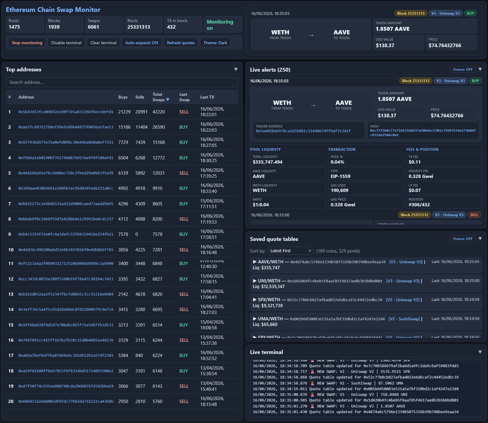
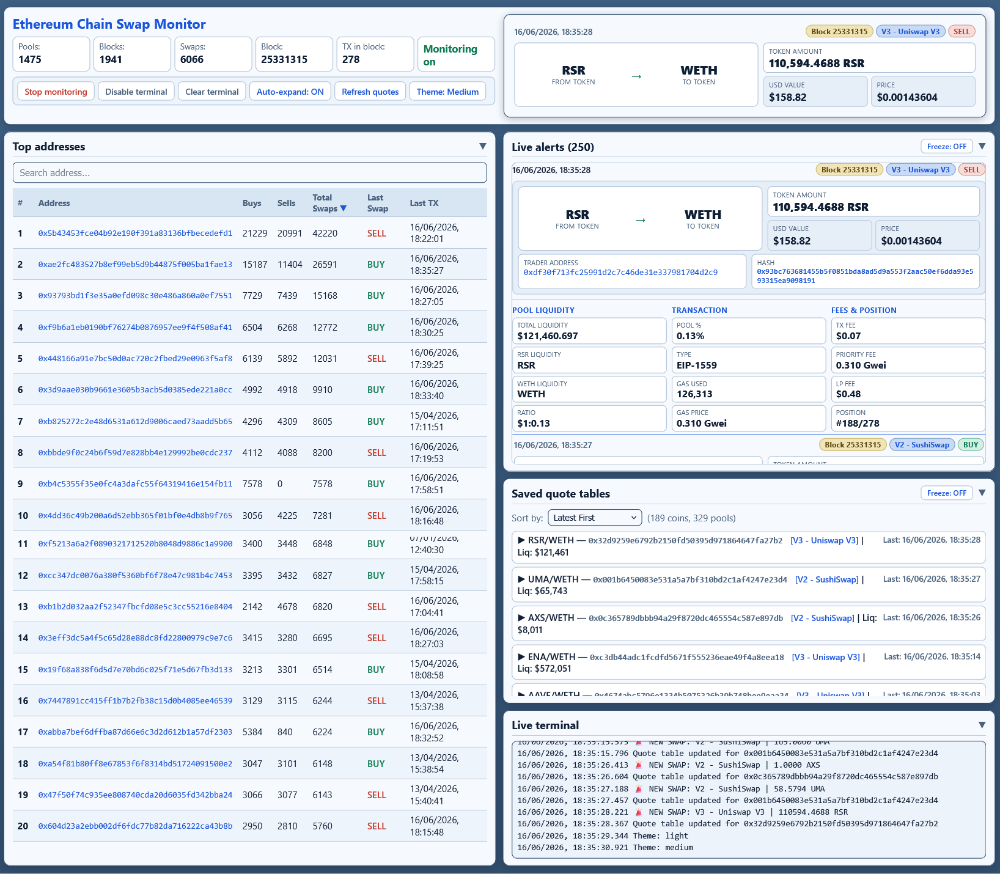
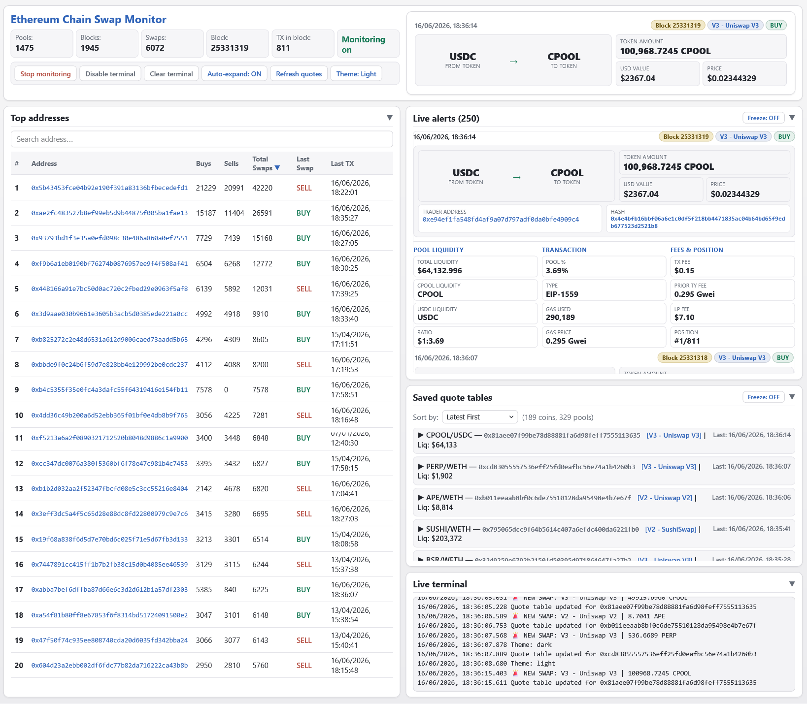
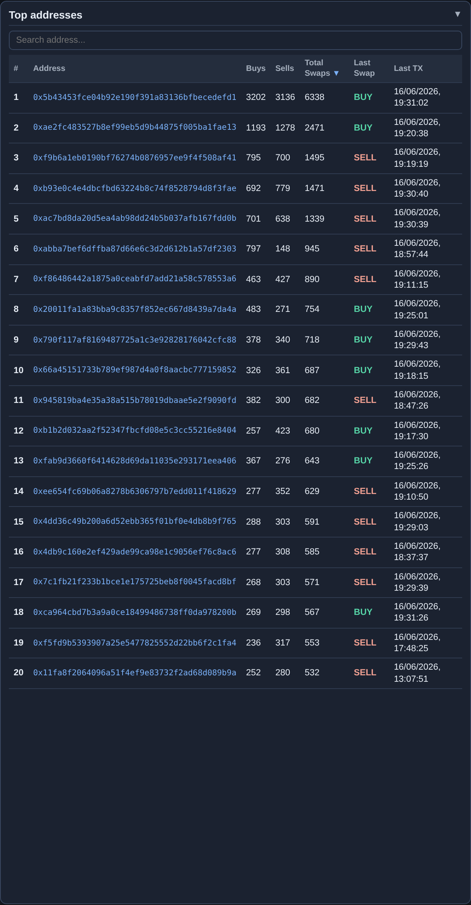
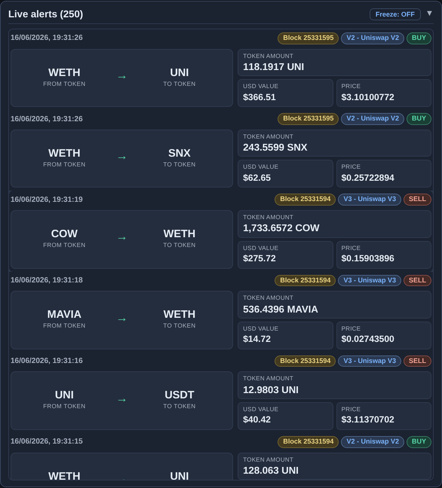
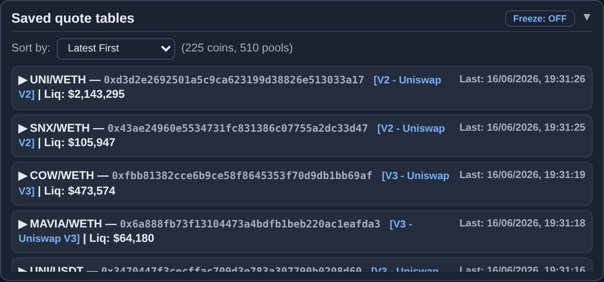
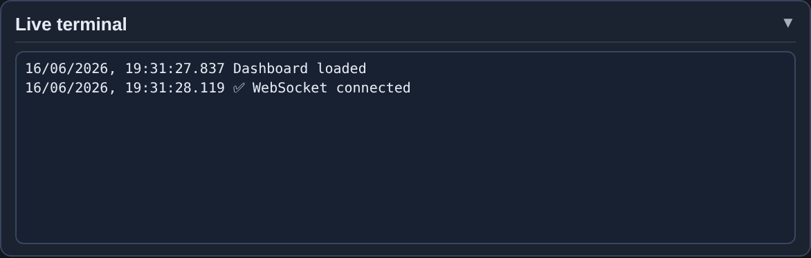

# Ethereum Chain Swap Monitor



On-chain DEX activity is noisy: thousands of pool logs per minute, mixed protocols, and wallet-sized trades buried in block data. **Ethereum Chain Swap Monitor** turns that stream into a single operator desk — ranked repeat traders, rich swap cards with USD context and trade-size ladders, and a live terminal — without refreshing Etherscan or juggling separate tools.

**Default mode (1)** subscribes to pool swap logs over **WebSocket** `eth_subscribe` against your own Geth or hosted RPC. Watchlist modes **2** and **4** scan blocks over **HTTP** when you care about specific wallets, not pool subscriptions. The browser dashboard streams over **WebSocket** (`/ws`); REST is used for initial load, search, and control actions only.

**Typical flows:** screen many pools for whale-sized V2/V3 swaps → stay on **mode 1**, **Auto-expand ON**, read the **Live alerts** feed. Follow a wallet list from `add1.txt` → switch to **mode 2**, watch **Watched** count and receipt-driven alerts. Compare slippage at standard notionals → expand a row in **Saved quote tables** and read the buy/sell ladder. Burst of swaps while reading one card → **Freeze** the alerts feed (socket keeps running), unfreeze when done. Night shift → **Theme: Dark**, collapse **Top addresses** if you need vertical space. Pause ingestion without losing the socket → **Stop monitoring**.

## Tech stack

| Layer | Technologies |
|-------|--------------|
| Core service | Python 3, FastAPI, uvicorn |
| Chain ingestion | Web3.py — **WebSocket** `eth_subscribe` pool `logs` (modes 1/3); **HTTP** block scan + receipts (modes 2/4) |
| Persistence | SQLite + rolling JSON/JSONL artifacts (stats, alert ring buffer, quote index) |
| UI | Single-page `dashboard.html` (inline CSS/JS) — primary operator UI |
| Streaming | REST bootstrap + **WebSocket** `/ws` for live push |
| Deployment | Self-hosted Linux; connects outbound to your Ethereum JSON-RPC / WS endpoint |

## Dashboard layout

The default UI is **Ethereum Chain Swap Monitor** (`dashboard.html`): a **two-column** layout tuned for long sessions — **Top addresses** on the left, **Live alerts**, **Saved quote tables**, and **Live terminal** stacked on the right. Typography is dense; panels **collapse** independently; accordion swap cards show one expanded detail view at a time.

Operator preferences persist in browser `localStorage` under `ecs-dashboard-prefs`: theme, auto-expand, independent feed/quotes freeze, scroll position, last expanded alert, collapsed panels, quote sort order, and last selected monitor mode.

### Visual themes — Dark, Medium, Light

Three themes share the same layout and controls; only palette and contrast change. Cycle with **Theme: Light / Medium / Dark** in the header — the choice is saved locally and echoed in the terminal log.

| Theme | Role |
|-------|------|
| **Dark** | Low-glare night work — charcoal page, slate panels, high-contrast buy/sell chips (featured hero above) |
| **Medium** | Layered blue panels on a soft page background for comfortable daytime contrast |
| **Light** | Neutral gray-white layout for bright rooms and portfolio captures |





### Header — session stats, controls, swap preview

The top band combines **session telemetry**, **transport controls**, a **monitor mode** selector, and a **swap preview** mini-card for the focused alert.

| Stat / control | Meaning |
|----------------|---------|
| **Pools** | Liquidity pools loaded from coin discovery metadata |
| **Blocks** | Blocks seen in the **current session** (resets on process restart) |
| **Swaps** | Swap events detected in the **current session** |
| **Block** | Latest chain head from the subscriber or poller |
| **TX in block** | Transaction count in that head block |
| **Monitoring on** | Ingestion active (green) or paused |
| **Mode / Watched** | Active monitor mode; watchlist size for modes 2 and 4 |
| **Stop monitoring** | Pauses chain ingestion; dashboard WebSocket stays up |
| **Disable terminal** / **Clear terminal** | Suppress or wipe the on-page log mirror |
| **Auto-expand: ON/OFF** | When ON, each new swap opens as the expanded accordion card |
| **Refresh quotes** | Forces `GET /api/quote_tables` regardless of freeze state |
| **Apply mode** | Hot-switches ingestion strategy (see Monitoring modes) |

The right-hand **swap preview** mirrors the selected or auto-expanded alert — route, protocol chips, amounts — so context stays visible while you scroll the feed or address table.

### Top addresses — repeat trader ranking

The left column ranks wallets by on-chain swap activity. Data comes from accumulated server-side stats (buy/sell counters), not from the current session alone.



- **Search** — filters the table when you type at least two characters of an address.
- **Sortable columns** — **Buys**, **Sells**, **Total Swaps** (default sort), **Last Swap** (BUY/SELL chip), **Last TX** (European `DD/MM/YYYY, HH:MM:SS`).
- **Etherscan links** — address cells open the wallet in a new tab.
- **Collapse** — header chevron hides the table; state is remembered in `ecs-dashboard-prefs`.

Use this panel to spot repeat flow into the same pools before you drill into individual alerts on the right.

### Live alerts — accordion swap feed

The **Live alerts** feed lists recent swaps from a server ring buffer plus live `new_alert` WebSocket events. Collapsed rows show time, block chip, protocol tag (V2/V3/DEX name), BUY/SELL chip, token route, amount, USD value, and unit price. **One card expands at a time** — click toggles accordion; **Auto-expand** opens each new event automatically.



Expanded cards add:

| Area | Fields |
|------|--------|
| **Identity** | Trader address and transaction hash — both link to Etherscan; clicks do not collapse the card |
| **Pool liquidity** | Total liquidity, per-token legs, USD ratio |
| **Transaction** | Pool % of trade, EIP type, gas used, gas price |
| **Fees & position** | TX fee (USD), priority fee, LP fee estimate, position index in block |

**Freeze: OFF/ON** on the alerts header stops **DOM re-rendering** only. The backend socket keeps ingesting; unfreezing catches up on the next render pass. Quote-table freeze is separate.

### Saved quote tables

Per-pool **trade-size ladders** at standard USD notionals — buy price, slippage, and sell-back for each step. Rows show pair name, pool address, protocol tag, last update time, and headline liquidity.



- **Sort by** — Latest first, oldest first, coin A–Z / Z–A, liquidity high/low.
- **Pool count** — summary label shows how many coins and pools are indexed.
- **Expand row** — click a header to reveal the full ladder table (Amount / Buy / Slippage / Sell); expanded pool IDs are remembered for the session.
- **Freeze** — pauses quote list UI updates; use **Refresh quotes** in the header to force a fetch.

### Live terminal

Mirrors server-side log lines and WebSocket lifecycle: connect/disconnect, theme changes, mode switches, `NEW SWAP` summaries, and quote-table update notices.



- **Disable terminal** — stops appending lines (ingestion unaffected).
- **Clear terminal** — wipes the visible buffer without deleting server history.

## Monitoring modes (backend)

| Mode | Transport | When to use |
|------|-----------|-------------|
| **1** — pool swaps | WebSocket `logs` | Default — subscribe to configured pool addresses with swap topic filter; includes new heads |
| **2** — wallet receipts | HTTP block scan | Watchlist file — scan blocks, fetch receipts, detect swap logs |
| **3** — all pool logs | WebSocket | Same pools as mode 1 without topic filter |
| **4** — wallet all tx | HTTP block scan | Watchlist — broader tx scan (same family as mode 2) |

Switch at runtime with the header dropdown and **Apply mode**, or `POST /api/mode`. The service **hot-restarts** the ingestion loop so **active** matches **desired**; modes **2** and **4** reload the watchlist without a full process restart.

Mode **1** requires a working **WebSocket** endpoint on your RPC node (`eth_subscribe`). Modes **2** and **4** intentionally use HTTP because vanilla nodes do not offer a practical WebSocket subscription for tens of thousands of watchlist addresses.

## Enrichment and persistence

Each confirmed swap can include buy/sell direction, USD notional (ETH/USD from Binance), gas paid, LP fee estimate, pool liquidity snapshot, and regenerated quote ladders.

Session header counters (**Blocks**, **Swaps**) live in process memory and reset on restart. Ranked addresses, the alert ring buffer, SQLite history, and saved quote files survive restarts.

## Operator integration

For automation outside the browser:

- **Live push** — connect to `/ws` for `new_alert`, `stats_update`, `quote_table_update`, `terminal_log`, and `block_update`.
- **Bootstrap** — `GET /api/stats`, `/api/alerts`, `/api/quote_tables` on load.
- **Controls** — `POST /api/toggle_monitoring`, `/api/toggle_terminal_log`, `/api/mode`.
- **Lookup** — `GET /api/search/{address}` for per-wallet history.

Legacy candy UI remains at `/candy` for reference; `/` serves the current dashboard.

## Quick start

```bash
python3 eth_chain_swaps_monitor.py --local
# Dashboard: http://localhost:8059/
```

Common flags: `--geth-custom`, `--drpc`, `--infura`, `--alchemy`, `--monitor-mode`, `--coins-file`, `--port`, `--ui-only`, `--interactive`.

Private implementation: [logicencoder/eth-chain-swaps-monitor](https://github.com/logicencoder/eth-chain-swaps-monitor). RPC keys and wallet lists stay on your infrastructure.

See [REPOS.md](REPOS.md) for repository links.

---

**Made by [Logic Encoder](https://logicencoder.com)** · [GitHub](https://github.com/logicencoder) · [Contact](https://logicencoder.com/contact/)
