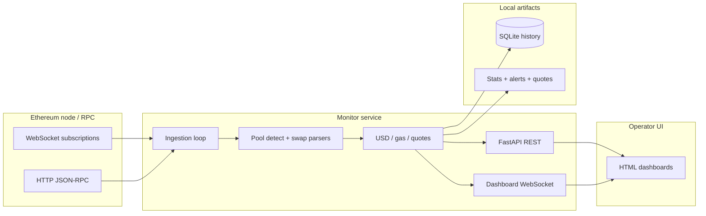

# ETH Chain Swaps Monitor — Overview

Public-facing description of the private application [`logicencoder/eth-chain-swaps-monitor`](https://github.com/logicencoder/eth-chain-swaps-monitor). This repo contains **no secrets**, no RPC keys, and no proprietary parser source.

## Positioning

| | |
|--|--|
| **What** | Standalone, operator-controlled Ethereum swap monitor with live dashboard |
| **Where it runs** | Dedicated infrastructure (local Geth or private RPC), not a multi-tenant SaaS |
| **Delivery today** | Local-first console on your own node |
| **Public website** | Planned; URL will be added when a hosted read-only view ships |

---

## Who this is for

### Traders and researchers

You need to see **large or repeated swaps** on specific tokens and pools without refreshing Etherscan. The tool surfaces buy/sell direction, USD size, pool liquidity context, and gas paid—so you can decide whether a move is actionable noise or structural flow.

### System engineers

You care about **event-driven ingestion** (WebSocket `eth_subscribe` with batching), **receipt-based fallback** when subscriptions are impractical, and a **hybrid API** (REST for state, WebSocket for push). The architecture is one deployable Python service plus static HTML, suitable for colocation with an Ethereum node.

### Recruiters and collaborators

This is evidence of **full-stack systems work**: chain decoding, financial normalization, persistence, and a real-time UI—not a tutorial CRUD app. The private repo holds implementation; this overview explains capabilities grounded in that code.

---

## Problem it solves

On-chain markets generate thousands of logs per minute. Manual exploration does not scale when you:

- Track many Uniswap V2/V3 (and related) pools for the same token universe
- Follow a **wallet watchlist** (whales, market makers, deployer wallets)
- Need **consistent USD framing** and **trade-size ladders** (e.g. “what if I buy $500?”) at decision time

The monitor **filters, decodes, enriches, and broadcasts** only swap-relevant activity tied to your configuration—reducing time from “something moved” to “who, how much, which pool, what slippage band.”

---

## High-level architecture

---

## Feature guide (what / why / who)

### 1. Multi-pool swap surveillance (Mode 1)

| | |
|--|--|
| **What** | Subscribes to swap event signatures on hundreds of pool contracts (batched subscriptions), plus pending txs and new blocks |
| **Why** | Lowest latency path when you already know which pools matter |
| **Who** | Operators running a WS-capable node or provider |

### 2. Wallet watchlist + receipt decoding (Mode 2)

| | |
|--|--|
| **What** | Polls new blocks; for addresses in `add1.txt`, loads receipts and detects swap logs—even on pools outside your config |
| **Why** | Follow **wallets** first; discover which pools they hit after the fact |
| **Who** | Whale tracking, counterparty research, debugging parser coverage |

Mode 2 can emit **proof events** for swaps on unknown pools (logged for review) and supports **historical backfill** over the last N blocks for validation runs.

### 3. Broad pool log capture (Mode 3)

| | |
|--|--|
| **What** | Subscribes to **all logs** from listed pool addresses (not only swap topics) |
| **Why** | Catch non-standard or newly indexed event layouts during protocol experiments |
| **Who** | Developers extending parsers |

### 4. Watchlist block scanning (Mode 4)

| | |
|--|--|
| **What** | Documented as watchlist + “all transactions”; shares the HTTP block scanner with Mode 2 in current builds |
| **Why** | Intended for full per-wallet tx visibility alongside swap detection |
| **Who** | Operators who prioritize address-centric monitoring over pool-centric |

### 5. Automatic pool type and DEX detection

| | |
|--|--|
| **What** | Probes contracts on-chain for V2 reserves, V3 fee tier, Curve/Maverick/DODO interfaces; maps factory to DEX name (Uniswap, SushiSwap, PancakeSwap V3, etc.) |
| **Why** | Avoid maintaining a static registry for every deployment |
| **Who** | Anyone adding pools via JSON config only |

### 6. Universal swap parsing (V2 / V3 / Curve / DODO / Maverick)

| | |
|--|--|
| **What** | Routes each log to a type-specific decoder; determines buy vs sell relative to your tracked token |
| **Why** | One pipeline for display, DB insert, and alerts |
| **Who** | Traders comparing execution across DEX generations |

### 7. USD valuation and trade ladders

| | |
|--|--|
| **What** | ETH/USD from public spot ticker; quote tokens WETH, stables, WBTC; prints and stores **buy/sell ladders** at $100–$1000 notionals (V2 math vs V3 quoter where available) |
| **Why** | Last trade price alone misstates impact for size |
| **Who** | Execution-focused users sizing entries/exits |

### 8. Live FastAPI dashboard

| | |
|--|--|
| **What** | Serves `candy.html` (primary) or legacy dashboards; default port 8059 |
| **Why** | Single process for chain thread + operator UI |
| **Who** | Day-to-day operators |

### 9. Real-time WebSocket feed (`/ws`)

| | |
|--|--|
| **What** | Pushes `new_alert`, `stats_update`, `block_update`, `quote_table_update`, keepalive pings |
| **Why** | Sub-second UI updates without polling `/api/alerts` |
| **Who** | Custom frontends or multi-screen setups |

### 10. REST control and query API

| | |
|--|--|
| **What** | Stats, alerts, address search, quote tables, mode change, pause monitoring, toggle terminal logging |
| **Why** | Automation, scripting, and lightweight clients |
| **Who** | Integrators wiring alerts into Slack/Telegram (external to this repo) |

### 11. Address statistics and “top traders”

| | |
|--|--|
| **What** | Aggregates buy/sell counts per `from` address; surfaces top 20 in `/api/stats` |
| **Why** | Spot repeat aggressors quickly |
| **Who** | Researchers building behavioral profiles |

### 12. SQLite transaction history

| | |
|--|--|
| **What** | Persists enriched swap rows (hash, pool, type, gas, method, position in block, …) |
| **Why** | Survive restarts; support later analytics |
| **Who** | Operators exporting history for spreadsheets or BI |

### 13. Quote table cache

| | |
|--|--|
| **What** | JSONL quote files + index; API can return summaries without full ladder payload |
| **Why** | Keep dashboard responsive under burst swap traffic |
| **Who** | UI users comparing pools side-by-side |

### 14. RPC provider flexibility

| | |
|--|--|
| **What** | Local Geth, LAN IP, Ankr, DRPC, Infura, Alchemy, QuickNode; env vars or CLI |
| **Why** | Resilience when one endpoint rate-limits or lacks WS |
| **Who** | DevOps moving between home lab and hosted RPC |

### 15. Operator controls without restart

| | |
|--|--|
| **What** | Toggle monitoring and terminal log; switch desired monitor mode via API |
| **Why** | Reduce noise during maintenance or chain reorgs investigation |
| **Who** | On-call operators |

### 16. Mode 2 diagnostics

| | |
|--|--|
| **What** | Counters for receipts fetched, swap logs found, unknown pools, skipped methods; optional debug trace for first N txs |
| **Why** | Prove the watchlist pipeline is healthy when alerts are quiet |
| **Who** | Engineers validating deployments |

---

## Tech stack (summary)

- **Backend:** Python, FastAPI, asyncio, Web3.py, websockets
- **Chain libraries:** eth_defi (Uniswap V3 quoter paths)
- **Frontend:** Static HTML/CSS/JS dashboards
- **Data:** SQLite + JSON/JSONL sidecars

---

## What is intentionally private

- Full source of `eth_chain_swaps_monitor.py`
- Production pool lists, watchlists, and database files
- Internal hostnames and API keys

---

## Related repositories

| Repository | Visibility |
|------------|------------|
| [eth-chain-swaps-monitor](https://github.com/logicencoder/eth-chain-swaps-monitor) | Private code |
| **eth-chain-swaps-monitor-overview** (this repo) | Public overview |

---

## Working style

Built incrementally: start from observable on-chain behavior, add parsers and modes as real transactions expose edge cases, then fold learnings into dashboard and persistence. Documentation here tracks **shipped behavior**, not a roadmap wishlist.

---

## Security disclosure

No credentials, private RPC URLs, or personal watchlist data belong in this public repo. For vulnerability reports, use the contact method you already use for LogicEncoder private infrastructure (not listed here to avoid spam).
